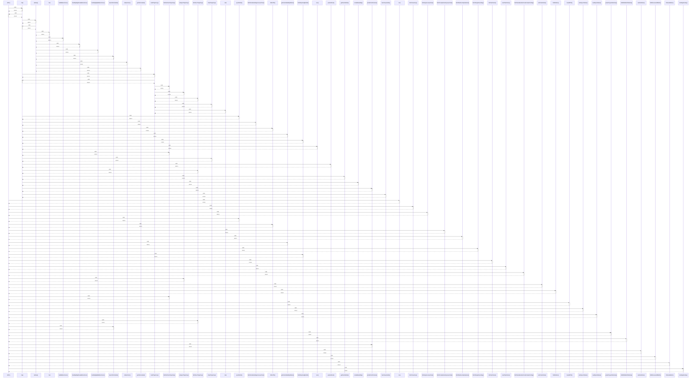

# GET()

> God node · 34 connections · [C:\Users\rudso\OneDrive\Documentos\Site_sonda\sondas\app\api\sync-status\route.ts](file:///C:/Users/rudso/OneDrive/Documentos/Site_sonda/sondas/app/api/sync-status/route.ts#L7)

## Call Trace Diagram

## Connections by Relation

### calls
- [[map]] `INFERRED`
- [[now]] `INFERRED`
- [[fetchInventory()]] `EXTRACTED`
- [[fetchApproxLaunches()]] `EXTRACTED`
- [[syncMonth()]] `EXTRACTED`
- [[DELETE()]] `EXTRACTED`
- [[fetchComplementaryLaunches()]] `EXTRACTED`
- [[fetchRadiosondyFeatures()]] `INFERRED`
- [[getCacheStatsByStation()]] `INFERRED`
- [[fetchSingleSounding()]] `EXTRACTED`
- [[fetchWyomingMonth()]] `EXTRACTED`
- [[listYearStores()]] `INFERRED`
- [[readYearStore()]] `INFERRED`
- [[fetchSondeHubArchiveFramesForDay()]] `INFERRED`
- [[analyzeTrajectory()]] `INFERRED`
- [[writeYearStore()]] `INFERRED`
- [[findStation()]] `INFERRED`
- [[fetchArchiveTrajectory()]] `INFERRED`
- [[nowGMT3()]] `INFERRED`
- [[writeSyncStatus()]] `INFERRED`

### contains
- [[route.ts]] `EXTRACTED`
- [[route.ts]] `EXTRACTED`
- [[route.ts]] `EXTRACTED`
- [[route.ts]] `EXTRACTED`

---

*Part of the graphify knowledge wiki. See [[index]] to navigate.*