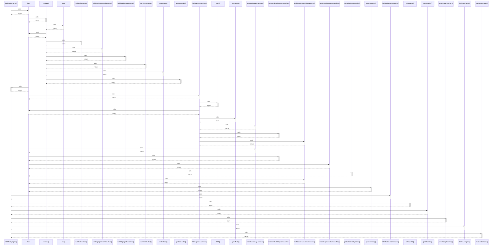

# fetchTodayFlights()

> God node · 8 connections · [C:\Users\rudso\OneDrive\Documentos\Site_sonda\sondas\app\lib\radiosondy.ts](file:///C:/Users/rudso/OneDrive/Documentos/Site_sonda/sondas/app/lib/radiosondy.ts#L131)

## Call Trace Diagram

## Connections by Relation

### calls
- [[has]] `INFERRED`
- [[fetchRadiosondyFeatures()]] `EXTRACTED`
- [[toReportStr()]] `EXTRACTED`
- [[gmt3DateStr()]] `EXTRACTED`
- [[parsePopupTelemetry()]] `EXTRACTED`
- [[fetchLiveFlights()]] `EXTRACTED`
- [[matchesStartplace()]] `EXTRACTED`

### contains
- [[radiosondy.ts]] `EXTRACTED`

---

*Part of the graphify knowledge wiki. See [[index]] to navigate.*