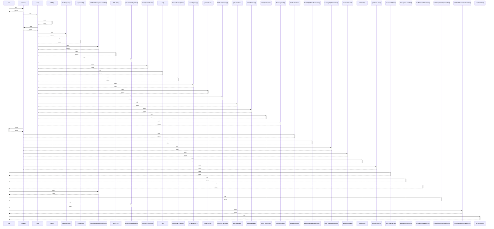

# has

> God node · 10 connections · [C:\Users\rudso\OneDrive\Documentos\Site_sonda\sondas\app\historico\components\MonthAccordion.tsx](file:///C:/Users/rudso/OneDrive/Documentos/Site_sonda/sondas/app/historico/components/MonthAccordion.tsx#L232)

## Call Trace Diagram

## Connections by Relation

### calls
- [[redraw()]] `INFERRED`
- [[fetchTodayFlights()]] `INFERRED`
- [[fetchApproxLaunches()]] `INFERRED`
- [[fetchRadiosondyLaunches()]] `INFERRED`
- [[fetchSondeHubApproxLaunches()]] `INFERRED`
- [[fetchComplementaryLaunches()]] `INFERRED`
- [[getCacheStatsByStation()]] `INFERRED`
- [[fetchSondeHubArchiveLaunches()]] `INFERRED`
- [[parseInventory()]] `INFERRED`

### contains
- [[MonthAccordion.tsx]] `EXTRACTED`

---

*Part of the graphify knowledge wiki. See [[index]] to navigate.*