# Knowledge Graph Index

> Auto-generated by graphify. Start here — read community articles for context, then drill into god nodes for detail.

**364 nodes · 503 edges · 40 communities**

---

## System Architecture Flowchart

```mermaid
flowchart TD
    C0["Radiosonde Access (40 nodes)"]
    C1["Launch Calendar (35 nodes)"]
    C2["Balloon Flight Tracker (32 nodes)"]
    C3["Weather Station Cache (30 nodes)"]
    C4["Community 4 (29 nodes)"]
    C5["YearStore Persistence (22 nodes)"]
    C6["Station Launch UI (22 nodes)"]
    C7["Community 7 (16 nodes)"]
    C8["Community 8 (15 nodes)"]
    C9["File List Manager (12 nodes)"]
    C10["Station Entry UI (10 nodes)"]
    C11["Flight Analytics (10 nodes)"]
    C12["Map Interaction (10 nodes)"]
    C13["Weather Data Retrieval (9 nodes)"]
    C14["Community 14 (7 nodes)"]
    C15["Configuration Management (5 nodes)"]
    C16["Community 16 (5 nodes)"]
    C17["Page Presentation (4 nodes)"]
    C18["Community 18 (4 nodes)"]
    C19["Daily Flight Stats (4 nodes)"]
    C20["Search Component (4 nodes)"]
    C21["unknown (4 nodes)"]
    C22["Build Automation (4 nodes)"]
    C23["unknown (3 nodes)"]
    C24["Monthly Chart Data (3 nodes)"]
    C25["Date Formatting (3 nodes)"]
    C26["Element State (3 nodes)"]
    C27["Next.js config (2 nodes)"]
    C28["unknown (2 nodes)"]
    C29["unknown (2 nodes)"]
    C30["unknown (2 nodes)"]
    C31["unknown (2 nodes)"]
    C32["unknown (2 nodes)"]
    C33["unknown (1 nodes)"]
    C34["unknown (1 nodes)"]
    C35["unknown (1 nodes)"]
    C36["unknown (1 nodes)"]
    C37["unknown (1 nodes)"]
    C38["unknown (1 nodes)"]
    C39["unknown (1 nodes)"]
    C5 -->|9 edges| C0
    C2 -->|7 edges| C0
    C5 -->|5 edges| C4
    C0 -->|5 edges| C3
    C0 -->|5 edges| C4
    C5 -->|4 edges| C3
    C0 -->|4 edges| C2
    C5 -->|3 edges| C2
    C1 -->|2 edges| C3
    C5 -->|2 edges| C11
    C2 -->|2 edges| C4
    C3 -->|2 edges| C4
    C11 -->|2 edges| C0
    C13 -->|2 edges| C0
    C2 -->|2 edges| C5
    C3 -->|1 edges| C1
    C7 -->|1 edges| C4
    C10 -->|1 edges| C5
    C5 -->|1 edges| C6
    C0 -->|1 edges| C6
    C6 -->|1 edges| C2
    C12 -->|1 edges| C2
    C14 -->|1 edges| C0
    C2 -->|1 edges| C3
    C4 -->|1 edges| C11
    C11 -->|1 edges| C4
    C4 -->|1 edges| C2
    C7 -->|1 edges| C0
```

## Communities
(sorted by size, largest first)

- [[Radiosonde Access]] — 40 nodes
- [[Launch Calendar]] — 35 nodes
- [[Balloon Flight Tracker]] — 32 nodes
- [[Weather Station Cache]] — 30 nodes
- [[Community 4]] — 29 nodes
- [[YearStore Persistence]] — 22 nodes
- [[Station Launch UI]] — 22 nodes
- [[Community 7]] — 16 nodes
- [[Community 8]] — 15 nodes
- [[File List Manager]] — 12 nodes
- [[Station Entry UI]] — 10 nodes
- [[Flight Analytics]] — 10 nodes
- [[Map Interaction]] — 10 nodes
- [[Weather Data Retrieval]] — 9 nodes
- [[Community 14]] — 7 nodes
- [[Configuration Management]] — 5 nodes
- [[Community 16]] — 5 nodes
- [[Page Presentation]] — 4 nodes
- [[Community 18]] — 4 nodes
- [[Daily Flight Stats]] — 4 nodes
- [[Search Component]] — 4 nodes
- [[unknown]] — 4 nodes
- [[Build Automation]] — 4 nodes
- [[unknown]] — 3 nodes
- [[Monthly Chart Data]] — 3 nodes
- [[Date Formatting]] — 3 nodes
- [[Element State]] — 3 nodes
- [[Next.js config]] — 2 nodes
- [[unknown]] — 2 nodes
- [[unknown]] — 2 nodes
- [[unknown]] — 2 nodes
- [[unknown]] — 2 nodes
- [[unknown]] — 2 nodes
- [[unknown]] — 1 nodes
- [[unknown]] — 1 nodes
- [[unknown]] — 1 nodes
- [[unknown]] — 1 nodes
- [[unknown]] — 1 nodes
- [[unknown]] — 1 nodes
- [[unknown]] — 1 nodes

## God Nodes
(most connected concepts — the load-bearing abstractions)

- [[GET()]] — 34 connections
- [[map]] — 18 connections
- [[pad()]] — 13 connections
- [[now]] — 11 connections
- [[has]] — 10 connections
- [[readCache()]] — 9 connections
- [[redraw()]] — 9 connections
- [[getClient()]] — 8 connections
- [[bucket()]] — 8 connections
- [[fetchTodayFlights()]] — 8 connections

---

*Generated by [graphify](https://github.com/safishamsi/graphify)*