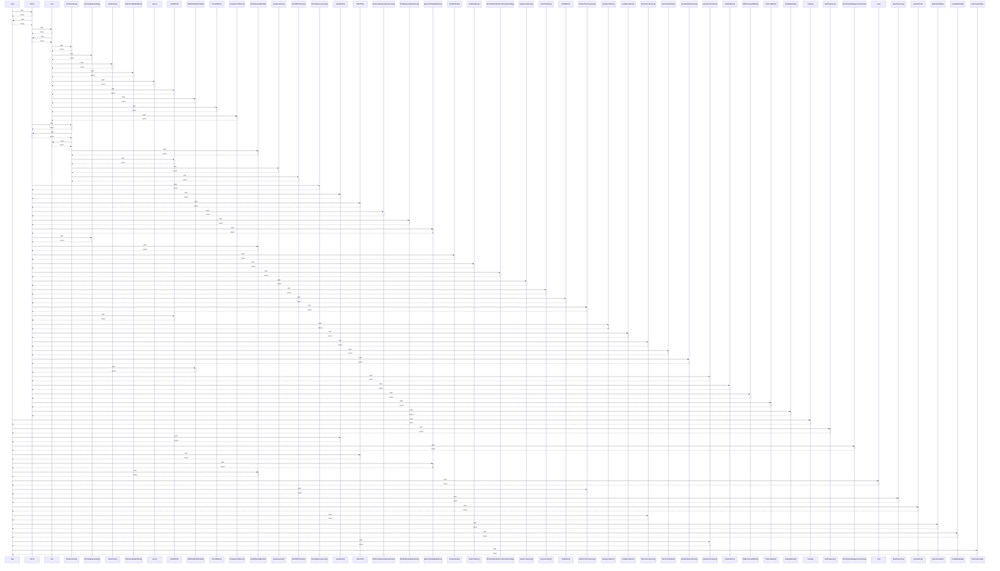

# map

> God node · 18 connections · [C:\Users\rudso\OneDrive\Documentos\Site_sonda\sondas\app\painel\components\MissionMap.tsx](file:///C:/Users/rudso/OneDrive/Documentos/Site_sonda/sondas/app/painel/components/MissionMap.tsx#L132)

## Call Trace Diagram

## Connections by Relation

### calls
- [[GET()]] `INFERRED`
- [[redraw()]] `EXTRACTED`
- [[loadTrajectory()]] `EXTRACTED`
- [[syncMonth()]] `INFERRED`
- [[fetchSondeHubApproxLaunches()]] `INFERRED`
- [[DELETE()]] `INFERRED`
- [[getCacheStatsByStation()]] `INFERRED`
- [[fetchWyomingMonth()]] `INFERRED`
- [[run()]] `INFERRED`
- [[fetchArchiveTrajectory()]] `INFERRED`
- [[drawTrajectory()]] `INFERRED`
- [[parseS3List()]] `INFERRED`
- [[fetchLiveTrajectory()]] `INFERRED`
- [[getCacheStats()]] `INFERRED`
- [[createBaseMap()]] `INFERRED`
- [[pointsFromFrames()]] `INFERRED`
- [[SummaryCards()]] `INFERRED`

### contains
- [[MissionMap.tsx]] `EXTRACTED`

---

*Part of the graphify knowledge wiki. See [[index]] to navigate.*