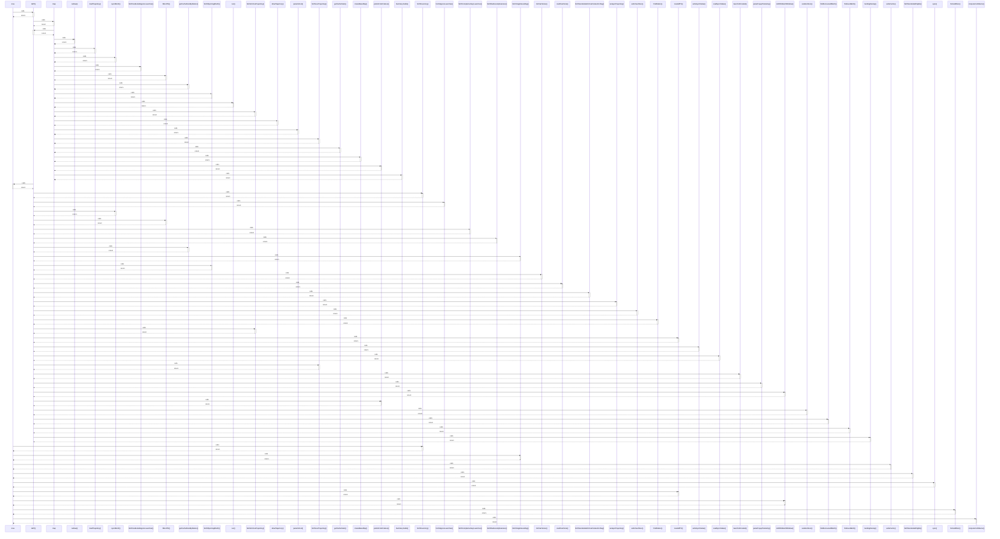

# now

> God node · 11 connections · [C:\Users\rudso\OneDrive\Documentos\Site_sonda\sondas\app\painel\page.tsx](file:///C:/Users/rudso/OneDrive/Documentos/Site_sonda/sondas/app/painel/page.tsx#L35)

## Call Trace Diagram

## Connections by Relation

### calls
- [[GET()]] `INFERRED`
- [[fetchInventory()]] `INFERRED`
- [[fetchSingleSounding()]] `INFERRED`
- [[writeCache()]] `INFERRED`
- [[fetchSondeHubFlights()]] `INFERRED`
- [[sync()]] `EXTRACTED`
- [[nowGMT3()]] `INFERRED`
- [[isWithinMatchWindow()]] `INFERRED`
- [[formatWhen()]] `INFERRED`
- [[computeConfidence()]] `INFERRED`

### contains
- [[page.tsx]] `EXTRACTED`

---

*Part of the graphify knowledge wiki. See [[index]] to navigate.*