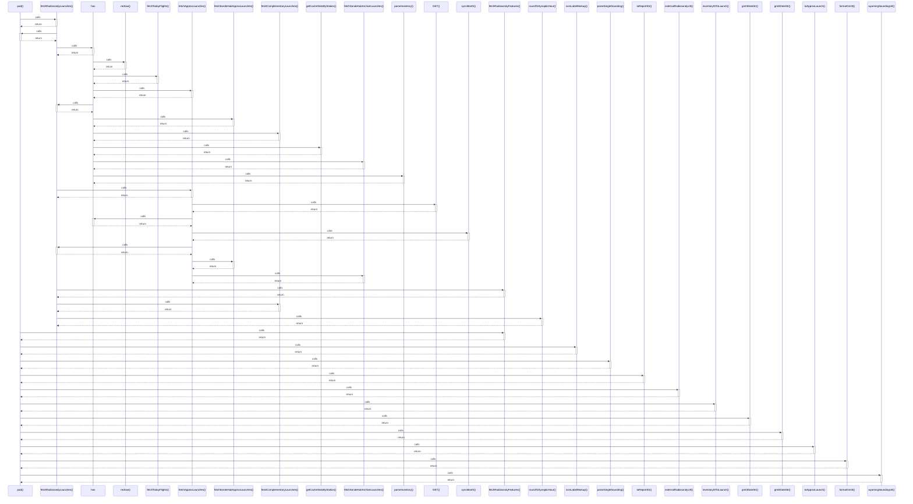

# pad()

> God node · 13 connections · [C:\Users\rudso\OneDrive\Documentos\Site_sonda\sondas\app\painel\components\TopStatusBar.tsx](file:///C:/Users/rudso/OneDrive/Documentos/Site_sonda/sondas/app/painel/components/TopStatusBar.tsx#L43)

## Call Trace Diagram

## Connections by Relation

### calls
- [[fetchRadiosondyLaunches()]] `INFERRED`
- [[fetchRadiosondyFeatures()]] `INFERRED`
- [[iconLabelMarkup()]] `INFERRED`
- [[parseSingleSounding()]] `INFERRED`
- [[toReportStr()]] `INFERRED`
- [[externalRadiosondyUrl()]] `INFERRED`
- [[inventoryDtToLaunch()]] `INFERRED`
- [[gmt3DateStr()]] `INFERRED`
- [[gmt3DateStr()]] `INFERRED`
- [[toApproxLaunch()]] `INFERRED`
- [[formatGmt3()]] `INFERRED`
- [[wyomingSoundingUrl()]] `INFERRED`

### contains
- [[TopStatusBar.tsx]] `EXTRACTED`

---

*Part of the graphify knowledge wiki. See [[index]] to navigate.*