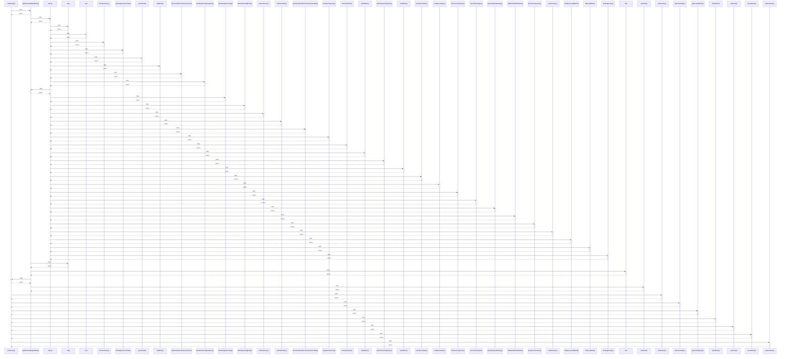

# readCache()

> God node · 9 connections · [C:\Users\rudso\OneDrive\Documentos\Site_sonda\sondas\app\lib\cache.ts](file:///C:/Users/rudso/OneDrive/Documentos/Site_sonda/sondas/app/lib/cache.ts#L26)

## Call Trace Diagram

## Connections by Relation

### calls
- [[getCacheStatsByStation()]] `EXTRACTED`
- [[writeCache()]] `EXTRACTED`
- [[getCacheStats()]] `EXTRACTED`
- [[getCacheByYear()]] `EXTRACTED`
- [[clearMonth()]] `EXTRACTED`
- [[clearYear()]] `EXTRACTED`
- [[clearStation()]] `EXTRACTED`
- [[exportCache()]] `EXTRACTED`

### contains
- [[cache.ts]] `EXTRACTED`

---

*Part of the graphify knowledge wiki. See [[index]] to navigate.*